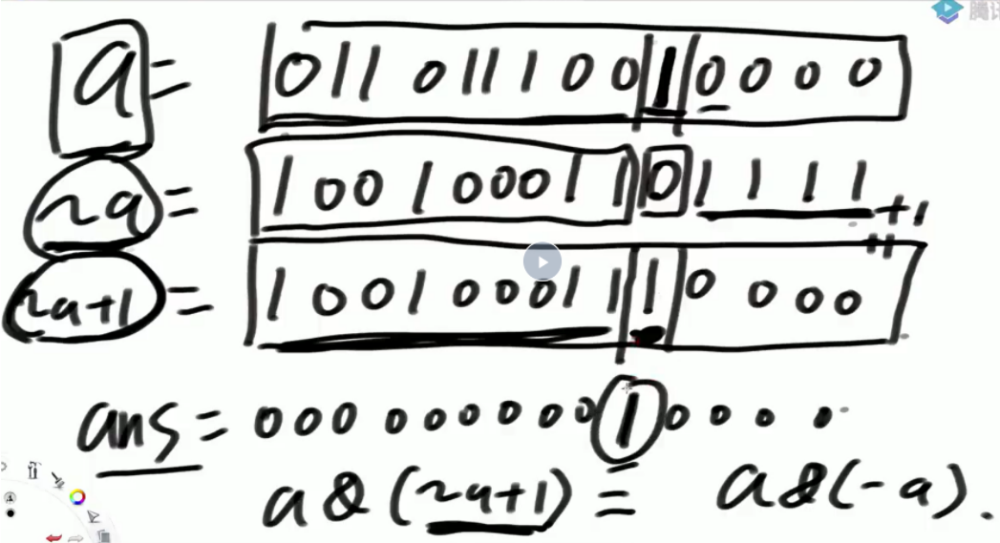

# 算法笔记

学习顺序

体系班 1-40    进阶班 49-78    进阶班 16-48    大厂刷题班

## 1.复杂度与常见排序

评估算法优劣的核心指标：

**时间复杂度** （注意分解到常数级操作，然后求操作总数量（找最差数据情况），得出结果只看**最高阶**）

### 1.1 选择排序

每次循环都找到待排序列中的最小值，放到最前，分别操作N、N-1、N-2次...，构成等差数列  a* N^2+b*N+c,

即O(N^2)

```java
public class SelectionSort {
    public static void selectionSort(int[] arr) {
        if(arr==null||arr.length<2) {
            return;
        }
        for(int i=0;i<arr.length-1;i++) {
            int minIndex=i;
            for(int j=i+1;j< arr.length;j++) {
                // 找到 i~N-1 上的最小值的下标
                minIndex=arr[j]<arr[minIndex]?j:minIndex;
            }
            swap(arr,i,minIndex);
        }
    }
    public static void swap(int[] arr,int i,int j) {
        int tmp=arr[i];
        arr[i]=arr[j];
        arr[j]=tmp;
    }
}
```

### 1.2 冒泡排序

两两比较，大的后撤，时间复杂度  O(N^2)

```java
public class BubbleSort {
    public static void bubbleSort(int[] arr) {
        if(arr==null||arr.length<2) {
            return;
        }
        //外层循环确定趟数
        for(int i=0;i< arr.length-1;i++) {
            boolean flag=false;//优化标记
            //内层循环调整元素，两两比较，遍历后把最大元素放在最后，每次比较次数-1
            for(int j=0;j< arr.length-1-i;j++) {
                if(arr[j]>arr[j+1]) {
                    swap(arr,j,j+1);
                    flag=true;
                }
            }
            if(!flag) break;
        }
    }
    
    public static void swap(int[] arr,int i,int j) {
        int tmp=arr[i];
        arr[i]=arr[j];
        arr[j]=tmp;
    }
}
```

### 1.3 插入排序

规则为使得前i个元素有序（i从0到数组末尾）

```java
public class InsertionSort {
    public static void insertionSort(int[] arr) {
        if(arr==null||arr.length<2) {
            return;
        }
        //i为0仅一个数时肯定有序
        for(int i=1;i<arr.length;i++) {//0~i 做到有序
            for(int j=i-1;j>=0&&arr[j]>arr[j+1];j--) {
                swap(arr,j,j+1);
            }
        }
    }
    public static void swap(int[] arr,int i,int j) {
        int tmp=arr[i];
        arr[i]=arr[j];
        arr[j]=tmp;
    }
}
```

### 1.4 常见复杂度排序

O(1)  <   O(logN)  <	O(N)  <	O (N*logN)   <  O(N^2)  <	 O(2^N)

## 2. 对数器

自己想出的方法不知如何找测试用例，可以找简单的方法进行海量测试，找出测试用例，再去验证好方法的正确性。

### 生成随机数

> Math.random()   --->[0,1)所有的小数，等概率返回一个
>
> Math.random()*N    --->[0,N)所有的小数，等概率返回一个
>
> (int) (Math.random()*N)    --->[0,N-1]所有的整数，等概率返回一个

### 插入排序及其对数器验证

```java
import java.util.Arrays;

public class InsertionSort {
    public static void insertionSort(int[] arr) {
        if(arr==null||arr.length<2) {
            return;
        }
        //i为0仅一个数时肯定有序
        for(int i=1;i<arr.length;i++) {//0~i 做到有序
            for(int j=i-1;j>=0&&arr[j]>arr[j+1];j--) {
                swap(arr,j,j+1);
            }
        }
    }
    public static void swap(int[] arr,int i,int j) {
        int tmp=arr[i];
        arr[i]=arr[j];
        arr[j]=tmp;
    }

    public static void comparator(int[] arr) {
        Arrays.sort(arr);
    }

    public static int[] generateRandomArray(int maxSize,int maxValue) {
        int[] arr=new int[(int)((maxSize+1)*Math.random())];
        //长度随机
        for(int i=0;i<arr.length;i++) {
            arr[i]=(int)((maxValue+1)*Math.random())-(int)((maxValue+1)*Math.random());
        }
        return arr;
    }

    public static int[] copyArray(int[] arr) {
        if(arr==null) {
            return null;
        }
        int[] res=new int[arr.length];
        for(int i=0;i<arr.length;i++) {
            res[i]=arr[i];
        }
        return res;
    }

    public static boolean isEqual(int[] arr1,int[] arr2) {
        if((arr1==null&&arr2!=null)||(arr1!=null&&arr2==null)) {
            return false;
        }
        if(arr1==null&&arr2==null) {
            return true;
        }
        if(arr1.length!=arr2.length) {
            return false;
        }
        for(int i=0;i<arr1.length;i++) {
            if(arr1[i]!=arr2[i]) {
                return false;
            }
        }
        return true;
    }

    public static void printArray(int[] arr) {
        if(arr==null) {
            return;
        }
        for (int i = 0; i < arr.length; i++) {
            System.out.print(arr[i]+" ");
        }
        System.out.println();
    }

    public static void main(String[] args) {
        int testTime=500000;
        int maxSize=10;//随机数组长度0~100
        int maxValue=100;//随机值：-100~100
        boolean succeed=true;
        for (int i = 0; i < testTime; i++) {
            int[] arr1=generateRandomArray(maxSize,maxValue);
            int[] arr2=copyArray(arr1);
            insertionSort(arr1);
            comparator(arr2);
            if(!isEqual(arr1,arr2)) {
                System.out.println("Fucking fucked!");
                succeed=false;
                printArray(arr1);
                printArray(arr2);
                break;
            }
        }
        if(succeed) {
            System.out.println("Nice!");
            int[] arr1=generateRandomArray(maxSize,maxValue);
            int[] arr2=copyArray(arr1);
            insertionSort(arr1);
            comparator(arr2);
            printArray(arr1);
            printArray(arr2);
        }
    }
}

```

## 3.二分法

二分不一定要求有序，只要能构建出排他性区域就可二分（一半符合条件，另一半不符合条件，使得区域范围不断缩小）。

### 3.1 有序数组中找到num

```java
public class BSExist {
    public static boolean exist(int[] sortedArr,int num) {
        if(sortedArr==null||sortedArr.length==0) {
            return false;
        }
        int L=0;
        int R=sortedArr.length-1;
        int mid=0;
        while (L<R) {//L..R至少有两个数的时候,退出循环的时候只剩一个数
            mid=L+((R-L)>>1);//(相当于(L+R)/2,为了防止溢出此处做优化)
            if(sortedArr[mid]==num) {
                return true;
            }else if(sortedArr[mid]>num) {
                R=mid-1;
            }else {
                L=mid+1;
            }
        }
        return sortedArr[L]==num;
    }
}
```

### 3.2 有序数组中找到>=num最左的位置

```java
public class BSNearLeft {
    public static int nearestIndex(int[] arr,int value) {
        int L=0;
        int R=arr.length-1;
        int index=-1;//记录大于等于value的最左下标
        while (L<=R) {
            int mid=L+((R-L)>>1);
            if(arr[mid]>=value) {
                index=mid;
                R=mid-1;
            }else {
                L=mid+1;
            }
        }
        return index;
    }
}
```

### 3.3 有序数组中找到<=num最右的位置

```java
public class BSNearRight {
    public static int nearestIndex(int[] arr,int value) {
        int L=0;
        int R=arr.length-1;
        int index=-1;
        while (L<=R) {
            int mid=L+((R-L)>>1);
            if(arr[mid]<=value) {
                index=mid;
                L=mid+1;
            }else {
                R=mid-1;
            }
        }
        return index;
    }
}
```

### 3.4 局部最小值问题

给定一个数组arr，已知任何两个相邻的数都不相等，找到随便一个局部最小位置返回

定义何为局部最小值：
arr[0] < arr[1]，0位置是局部最小；
arr[N-1] < arr[N-2]，N-1位置是局部最小；
arr[i-1] > arr[i] < arr[i+1]，i位置是局部最小；

**题解思路**：

先找两个边界的值，是否是局部最小，如果是则返回，不是则继续找；

如果两个边界都不是局部最小值，说明开头结尾的单调性符合下图（中间区域单调性不确定），但说明一定存在局部最小在区域范围内。

 

找mid值，判读其是否为局部最小，如果是则返回，如果不是则可以确定中间区域的单调性来缩小一半范围（如下图，中间连升，则砍掉右边区域）

 


**代码实现**：

```java
public class BSAwesome {
    public static int getLessIndex(int[] arr) {
        if(arr==null||arr.length==0) {
            return -1;
        }
        if(arr.length==1||arr[0]<arr[1]) {
            return 0;
        }
        if(arr[arr.length-1]<arr[arr.length-2]) {
            return arr.length-1;
        }
        int L=1;
        int R= arr.length-2;
        int mid=0;
        while (L<R) {
            mid=L+((R-L)>>1);
            if(arr[mid]>arr[mid-1]) {
                R=mid-1;
            }else if(arr[mid]>arr[mid+1]) {
                L=mid+1;
            }else {
                return mid;
            }
        }
        //代码如果在一开始的边界处没有返回，说明结果一定在中间区域
        //如果二分到最后只剩一个数，则这个数肯定是结果
        return L;
    }
}
```

## 4.异或运算

### 4.1 异或运算的性质

异或运算可以记忆成是**无进位加法**。

由上可推出以下三个性质：

1）0^N=N

2）N^N=0

3）一堆数异或，无论谁与谁异或的先后顺序，**最后结果一定是一个数**（也就是满足交换律和结合律）

（因为异或的结果，只与1的个数的奇偶性决定，与先后顺序无关，无论按照怎样的顺序，最后异或到一起的结果一定是一个数）

### 4.2 题目

#### 4.2.1

**不用额外变量交换两个数的值  不用额外变量交换数组中两个数的值**

题解思路：

利用异或操作符完成交换

> a=甲   b=乙

> a=a^b    ==>  a=甲^乙   	b=乙

> b=a^b    ==>  a=甲^乙      b=甲^乙^乙=甲

> a=a^b    ==>  a=甲^乙 ^甲=乙

代码实现：

```java
public static void swap(int[] arr,int i.int j) {
    arr[i]=arr[i]^arr[j];
    arr[j]=arr[i]^arr[j];
    arr[i]=arr[i]^arr[j];
}
```

#### 4.2.2 

**一个数组中有一种数出现了奇数次，其他数都出现了偶数次，怎么找到并打印这种数** 

题解思路：

因为异或操作符合交换律和结合律，所以这些数，如果出现了偶数次，互相异或的结果为0，这些所有数的异或结果，就是这个出现奇数次的数。

代码实现：

```java
public static void printOddTimesNum(int[] arr) {
    int eor=0;
    for(int i=0;i<arr.length;i++) {
        eor^=arr[i];
    }
    System.out.println(eor);
}
```

#### 4.2.3 

**怎么把一个int类型的数，提取出二进制中最右侧的1来**

题解思路：




`~a`使得a最右侧的1的左侧所有位上，全部与原来的数相反（1->0,0->1）,1的右侧也相反（全部是1，之前全部是0），让`~a+1`,就使得原来`~a`1右侧的所有1进位变成0，则`a`与`~a+1`此时各个数位上的情况是，最右侧1的左边全部相反，最右侧1的右边两个数全部都是0,让`a&(~a+1)`最后的结果就是得到了最右侧的1.

代码实现：

````java
int rightOne=a&(~a+1)
````

#### 4.2.4

**一个数组中有两种数出现了奇数次，其他数都出现了偶数次，怎么找到并打印这两种数**

题解思路：

该题与`4.2.2`不同的是，这些数中，有两个数出现了奇数次，假设这两个数分别为a，b,那么这些所有的数异或后的结果就是`a^b`(记为`eor`)，根据`eor`最右侧的1来确定a和b在这一位上不同，那么进一步，可以根据这一位的情况，将所有数分为两组，一组是这一位为0的组，另一组是这一位为1的组，a、b分别在两组中，在每一组数中，仍然是符合a、b出现奇数次，其他数都出现偶数次的，在分开的组中进行异或，得到的最终结果就是**两个数**中的一个数（记为onlyOne,假设就是a），让`onlyOne^eor<=>a^(a^b)`，就求出了另一个数。

代码实现：

```java
public static void printOddTimesNum(int[] arr) {
        int eor=0;
        for (int i = 0; i < arr.length; i++) {
            eor^=arr[i];
        }
        //eor=a^b
        int rightOne=eor&(~eor+1);

        //根据最右侧的一确定的数位进行分组
        int onlyOne=0;
        for (int i = 0; i < arr.length; i++) {
            //  arr[1] =  111100011110000
            // rightOne=  000000000010000
            if((arr[i]&rightOne)!=0) {//该为为1进行异或
                onlyOne^=arr[i];
            }
        }
        System.out.println(onlyOne+" "+(eor^onlyOne));
    }
```

#### 4.2.5 

**一个数组arr中有一种数a出现K次，其他数都出现了M次，已知M > 1，K < M，找到出现了K次的数a，要求额外空间复杂度O(1)，时间复杂度O(N)**

题解思路：

创建一个长度为32的count数组，count数组的每一位上的数，记录arr中的所有的数在该位上1出现的次数，如果count[i]%M！=0,说明a在该位上一定为1，就这样根据count数组的每一位与M取余的结果，确定a的值。

代码实现：
```java
public static int km(int[] arr,int k,int m) {
        int[] count=new int[32];
        //统计arr数组中所有数上1出现的位置的次数
        for(int num:arr) {
            for (int i = 0; i < 32; i++) {//每个数的32位都需要统计
                count[i]+=(num>>i)&1;
            }
        }
        int ans=0;
        for (int i = 0; i < 32; i++) {
            count[i]%=m;
            if(count[i]!=0) {
                ans|=1<<i;//将对应位为1的替换到ans上
            }
        }
        return ans;
}
```


对数器验证：（另一种测试方法为哈希表计数）
```java
public class KM {
    /*
    输入一定能够保证，数组中所有的数都出现了M次，只有一种数出现了K次
    1<=K<M
    返回这种数
    */
    
    public static int km(int[] arr,int k,int m) {
        int[] count=new int[32];
        //统计arr数组中所有数上1出现的位置的次数
        for(int num:arr) {
            for (int i = 0; i < 32; i++) {//每个数的32位都需要统计
                count[i]+=(num>>i)&1;
            }
        }
        int ans=0;
        for (int i = 0; i < 32; i++) {
            count[i]%=m;
            if(count[i]!=0) {
                ans|=1<<i;//将对应位为1的替换到ans上
            }
        }
        return ans;
    }
    public static int test(int[] arr,int k,int m) {
        HashMap<Integer,Integer> map=new HashMap<>();
        for(int num:arr) {
            if(map.containsKey(num)) {
                map.put(num,map.get(num)+1);
            }else {
                map.put(num,1);
            }
        }
        int ans=0;
        for (int num: map.keySet()) {
            if(map.get(num)==k) {
                ans=num;
                break;
            }
        }
        return ans;
    }

    public static int[] randomArray(int maxKinds,int maxValue,int k,int m) {
        int kTimeNum=randomNumber(maxValue);
        //真命天子出现次数
        int times=k;
        //最少得出现两种数
        int numKinds=(int)(Math.random()*maxKinds)+2;
        //生成随机数组,长度由每种数的出现次数决定
        int[] arr=new int[times+(numKinds-1)*m];
        int index=0;
        for (int i = 0; i < times; i++) {
            arr[index++]=kTimeNum;
        }
        numKinds--;
        HashSet<Integer> set=new HashSet<>();
        set.add(kTimeNum);
        while (numKinds!=0) {
            int curNum=0;
            do {
                curNum=randomNumber(maxValue);
            }while (set.contains(curNum));
            set.add(curNum);
            numKinds--;
            for (int i = 0; i < m; i++) {
                arr[index++]=curNum;
            }
        }
        //arr填好了然后打乱
        for (int i = 0; i < arr.length; i++) {
            int j=(int) (Math.random()*arr.length);//0~N-1
            int tmp=arr[i];
            arr[i]=arr[j];
            arr[j]=tmp;
        }
        return arr;
    }

    //随机生成出现K次的数
    //范围[-maxValue,maxValue]
    public static int randomNumber(int maxValue) {
        return (int)(Math.random()*(maxValue+1))-(int)(Math.random()*(maxValue+1));
    }
    public static void main(String[] args) {
        int maxKinds=10;//最多出现maxKinds种数
        int maxValue=50;//最大值
        int testTimes=10000;//测试次数
        int maxKM=9;//k、m的最大值
        System.out.println("测试开始");
        for (int i = 0; i < testTimes; i++) {
            int a=(int)(Math.random()*maxKM)+1;//1~9
            int b=(int)(Math.random()*maxKM)+1;//1~9
            int k=Math.min(a,b);
            int m=Math.max(a,b);
            //k<m
            if(k==m) {
                m++;
            }
            int[] arr=randomArray(maxKinds,maxValue,k,m);
            int ans1=km(arr,k,m);
            int ans2=test(arr,k,m);
            if(ans1!=ans2) {
                System.out.println(ans1);
                System.out.println(ans2);
                System.out.println("出错了！");
            }
        }
        System.out.println("测试结束!");
    }
}
```

